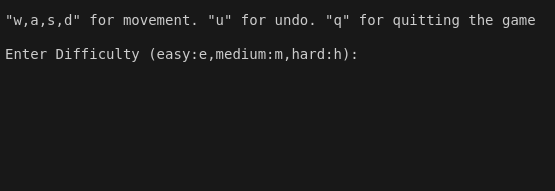
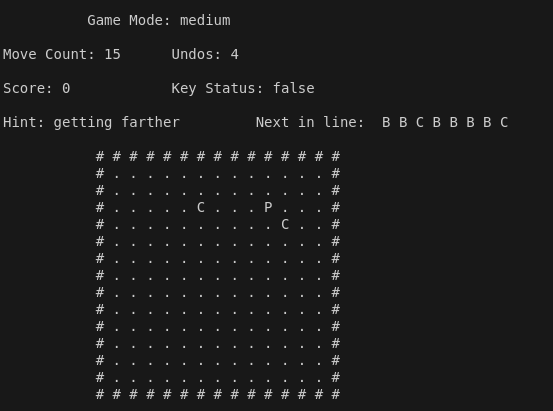
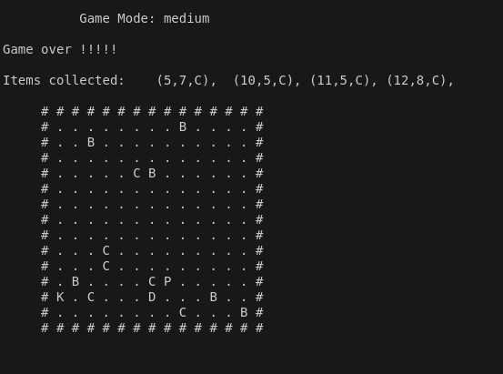

<h1 align="center">The Blind Maze Game</h1>
 
<h3><b> Requirements </b></h3>
<ul>
  <li> C++ 11</li>
  <li> nucrses</li>
</ul>
 
<h3> About Game </h3>
<ul>
  <li> The game is set in a dark scary room.</li>
  <li> The player is blind and can only sense surroundings</li>
  <li> The player must use his sense to find the key then find the door and escape</li>
  <li> The player must avoid bombs while doing this </li>
</ul>
 
<h3> About Implementation </h3>
<ul>
  <li> The game is made using C++ </li>
  <li> The data stuctures used are multi linked linked list, stack and queue </li>
  <li> The grid is made using quadruply linked linked list </li>
  <li> The undo feature is made by storing moves in stack and popping from it </li>
  <li> The coins picked up by player are stored in a 1D linked list </li>
  <li> The coins and bombs displayed on the screen are stored in a queue that cycles according to a timer </li>
  <li> The coins and bombs that are to be displayed next in line are also stored in a queue that cycles according to timer and difficulty level </li>
  <li> Added additional animations when player steps on bomb to make game look a bit more fun </li>
  <li> Added a rock, paper, scissors game when player steps on bomb to give player a chance </li>
  <li> Printing is all done use ncurses.h library </li>
</ul>

<h3> How to play </h3>
<ul>
  <li> open command prompt </li>
  <li> write make </li>
  <li> once the make is finished write ./game </li>
  <li> the game will run and show you start menu </li>
</ul>

<h3> Screenshots of game </h3>
<ul>
  <li> Starting screen </li>
  <li></li>
  <li> Game running </li>
  <li></li>
  <li> Game End </li>
  <li></li>
</ul>
